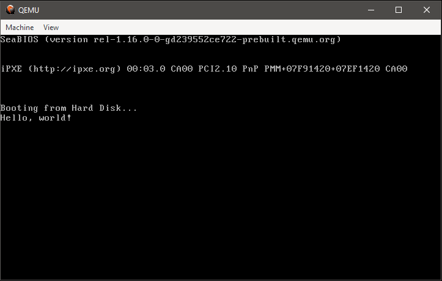

# Инструкции процессора

### add <операнд1>, <операнд2>
Добавить <операнд1> ко <операнду2> (<операнд1> + <операнд2>)

### cmp <операнд1>, <операнд2>
Сравнить <операнд1> с <операндом2>

### sub <операнд1>, <операнд2>
Вычитать <операнд2> из <операнда1> (<операнд1> - <операнд2>)

### mov <операнд1>, <операнд2>
Переместить регистр <операнд1> в регистр <операнд2>


# Примеры:

#### Пример №1

Си:
```c
if(x >= y)
  print("X >= y");
```

Ассемблер:
```nasm
; (переменные x и y находятся в регистрах cx и dx)
cmp cx, dx
jge action
action:
  mov si, r
  call print
  r db 'X >= y'
```

#### Пример №2

Си:
```c
long factorial(long n) {
  if(n == 0)
    return 1;
  else
    return n * factorial(n - 1);
}
```

Ассемблер:
```nasm
; (переменная n в регистре cx, само число будет в bx)
factorial:
  cmp cx, 0
  je i1
  jne else
  i1:
    mov bx, 1
  else:
    sub cx, 1
    call factorial
    mov ax, cx
    mul cx
    mov bx, ax
```

#### Пример №3

Си:
```c
int multiply(int a, int b) {
  return a * b
}
```

Ассемблер:
```nasm
; (переменные a, b в регистрах ax и bx, само число будет в ax)
multiply:
  mov ax, ax
  mov cx, bx
  mul cx
  mov ax, ax
```

# Первые программы

Программы, которые мы будем писать

Для этого нужно:
* Ядро Linux
* Процессор семейства Intel x86

#### Простая программа, которая выведет текст и вернет код выхода 0 (успех)

hello.asm:
```nasm
section .data
  msg db 'Hello, world!',0
  len equ $ - msg
 
section .text ; Секция с кодом
  global _start ; Должно быть для GCC
_start:
  mov eax, 4 ; EAX - регистр с номером функции, 4 - системный вызов SYS_WRITE
  mov ebx, 1 ; EBX - регистр с потоком вывода, 1 - поток STDOUT
  mov ecx, msg ; ECX - регистр с текстом, msg - наше сообщение
  mov edx, len ; EDX - длина текста, len - число с длиной нашего сообщения
  int 0x80 ; INT - прерывание, 0x80 - вызов ядра Linux
  mov eax, 1 ; 1 - системный вызов SYS_EXIT
  mov ebx, 0 ; EBX - код выхода
  int 0x80 ; Можно и 80h, или 0x80, без разницы 80h или 0x80, оно в любом случае будет вызывать ядро Linux
```

Команды:
```bash
$ nasm -f elf -o hello.o hello.asm
$ ld -o hello hello.o
$ ./hello
Hello, world!
$ echo $?
0
```

#### Программа, которая суммирует два числа и выводит результат на экран

summing.asm:
```nasm

section .text
  global _start

_start:
  mov eax, [x] ; Перемещаем значение 4 в EAX
  sub eax, '0' ; Преобразование ASCII в цифру
  
  mov ebx, [y] ; Перемещаем значение 4 в EBX
  sub ebx, '0' ; Преобразование ASCII в цифру
  
  add eax, ebx ; Добавим значение регистра EBX ко регистру EAX
  add eax, '0' ; Преобразование цифру в ASCII обратно

  mov [sum], eax ; Сохраняем сумму чисел в sum


  mov edx, len
  mov eax, 4
  mov ebx, 1
  mov ecx, msg
  int 0x80
  
  mov eax, 4
  mov ebx, 1
  mov ecx, sum ; Обязательно! Не пишите [sum], просто пишите sum
  mov edx, 1
  int 0x80
  
  mov eax, 1
  mov ebx, 0
  int 0x80

section .data
  x db '4'
  y db '4'
  msg db 'Sum of x and y is '
  len equ $ - msg

segment .bss ; Сегмент с неинициализированными переменными
  sum resb 1
 
```

Команды:
```bash
$ nasm -f elf -o summing.o summing.asm
$ ld -o summing summing.o
$ ./summing
Sum x and y is 8
$ echo $?
0
```

#### Программа, которая вызывает функцию из библиотеки языка программирования Си

cwithasm.asm:
```nasm

extern _printf

section .text
  global _start

_start:
  push msg
  call _printf

section .data
  msg db 'Hello, world!'

```

Команды:
```bash
$ nasm -f elf -o asmwithc.o asmwithc.asm
$ ld -o cwithasm asmwithc.o -llibc.so.6
$ ./asmwithc
Hello, world!
```

# Операционные системы

Ассемблер используют не только для создания компьютерных программ, он также хорошо подходит для операционных систем (так, в [ядре Linux](https://github.com/torvalds/linux "Linux") есть части кода написанных на нем)

### Простая операционная система

hello.asm:
```nasm
[bits 16] ; Директива NASM, таким образом мы говорим ассемблеру генерировать 16-битный код
[org 0x7c00] ; Организовать место в памяти, куда нас загрузит BIOS / UEFI(в режиме Legacy Mode)

jmp _start ; Немедленно прыгаем на метку _start

_start:
	mov ax, ax
  mov si, string
  call print
	string db 'Hello, world!',0 ; Запятая и ноль обязательна (если их не будет, мы увидим мусор из памяти)

print:
	lodsb
	cmp al, 0
	je .end
	mov ah, 0eh
	mov bh, 0
	int 10h
	jmp print
	.end:
		mov al, 0
		ret

mbr:
	; Делаем сектор загрузочным
	times (510 - ($ - $$)) db 0x00
	dw 0xAA55

```

Команды:
```bash
$ nasm -f bin -o hello.img hello.asm
$ qemu-system-x86_64 hello.img
```
Результат:


<br/>
<p align="center">
Навигация:
  
  <div align="left">
    ⇜ <a href="start.md">Прошлая страница</a>
  </div>
  <div align="right">
    ⇝ <a>Следующяя страница</a>
  </div>
</p>

